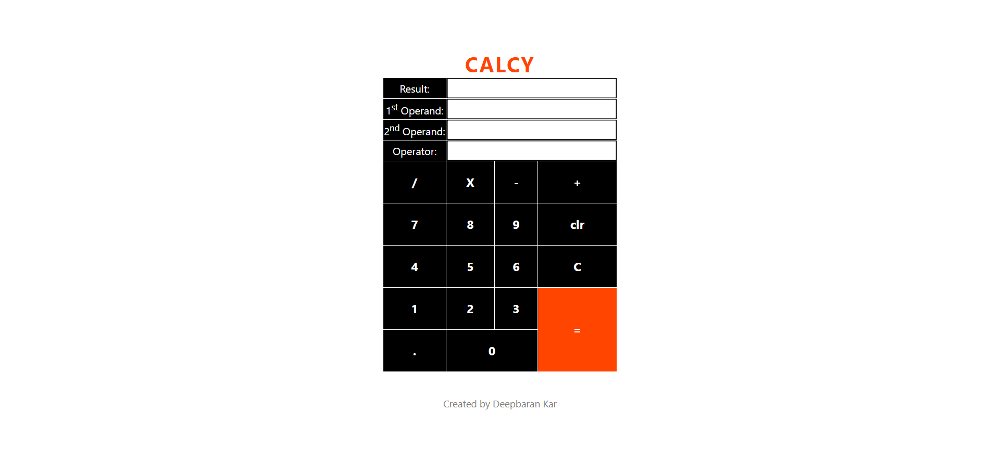
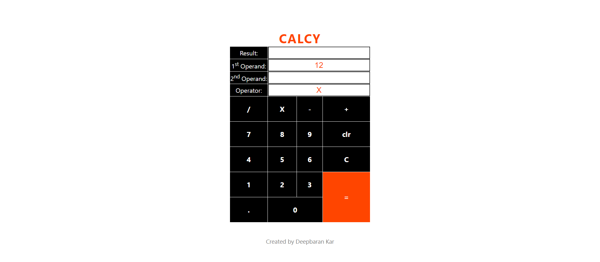

# CALCY

## Check out the Application Here : [Click Here](https://deepbaran.github.io/Calcy/)

### This is a Calculator Web Application, that can help you solve calculations.

### This application is built using:

- React.js
- React Hooks
- Context API
- JSX

## Here is how the Application looks like

### How to use:

- Click on the digits of the 1st Operand before choosing the operator
  
- Choose the operator before clicking on the digits of the 2nd operator
  
- Click on the digits of the 2nd Operand
  
- Click on '=' to get the result
  
- Click on 'clr' to clear dgits of the numbers
- Click on 'C' to clear out all the fields

#### Disclaimer:

This application does not use any storage. So, either closing or refreshing the page will cause in data loss.
